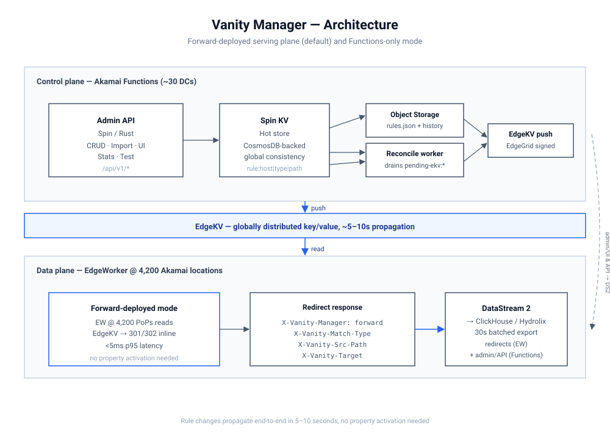
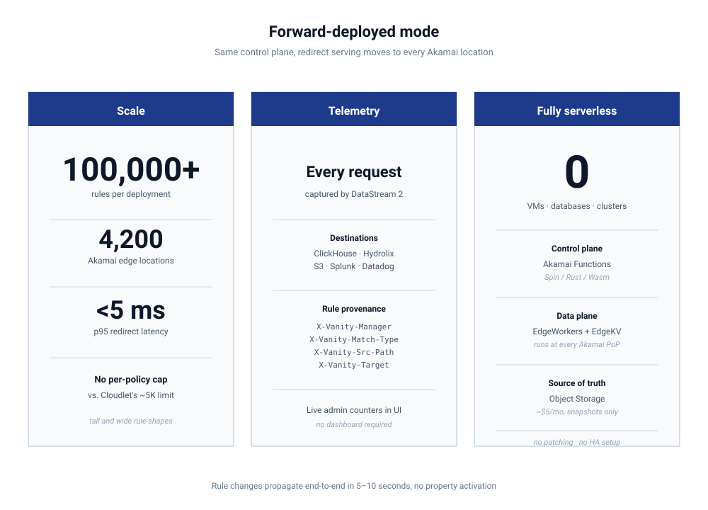

# Vanity Manager

Akamai Functions + EdgeWorker redirect engine with API-driven management.
A working reference for operators managing thousands to hundreds of
thousands of redirect rules — site-portfolio consolidation, acquisition-
driven domain rolls, mass marketing redirects, vanity URL fleets — without
the per-policy rule-count caps of Cloudlet-based products and without
requiring an Akamai property activation for every rule change.

The admin UI is served at `/api/v1/ui` and is bearer-token gated.

## Two serving modes

The same control plane drives two serving topologies; both ship together,
pick per deployment.

**Functions-only.** All requests terminate at one of the Akamai Functions
data centers and the Rust component resolves the rule from KV. Honest
origin behavior, simplest mental model, fine for low-volume management.
Every redirect is a client→Functions round trip.

**Forward-deploy.** The serving path is pushed out to all 4,200 Akamai
edge locations. An EdgeWorker reads the rule directly from EdgeKV at the
nearest PoP and synthesizes the 301 in place. Functions stays as the
control plane only — admin UI, API, write-through to EdgeKV, snapshot to
Object Storage, and a `/resolve` fallback the EdgeWorker calls on
transient EdgeKV read errors. Sub-100 ms p99 redirect latency is
attainable at the edge; rule changes never touch the Akamai property.



## What's in the box



- **Admin API + UI** — Rust on Spin / Akamai Functions, embedded in the
  same Wasm component as the static UI. CRUD over rules, hosts, bulk
  import/export, snapshot publish, marker queue inspection. The UI also
  carries an in-browser load-test rig and a Verify tab — twelve
  self-cleaning round-trip tests across the API surface, useful for
  smoke-testing a deployment after changes.
- **EdgeWorker** — JS, runs at every Akamai PoP. Reads `_hosts::<host>`
  sentinel + per-host exact and prefix manifests from EdgeKV. Emits
  `Server-Timing: ew;dur=<ms>` so client-side rigs can measure the
  edge handler's self-time. Per-host case-sensitivity flag carried in
  the sentinel; sentinel cached per-instance with a 5-minute TTL to cut
  one EdgeKV read off the steady-state hot path.
- **Pluggable KV backend** — default is Akamai's managed Spin KV
  (CosmosDB-backed). For larger-scale demos, a NATS adapter with
  prefix-scan support can be configured per deployment via the
  `kv_backend` Spin variable. See [DECISIONS.md](./DECISIONS.md), ADR-011.
- **Reconcile worker** — drains a pending-marker queue when async-mode
  imports defer EdgeKV writes. HTTP-triggered today; drop-in for a Spin
  cron trigger when the platform supports it on Akamai Functions.
- **DataStream 2 capture** — per-redirect `X-Vanity-*` response headers
  emitted by the EdgeWorker make the rule that fired observable in the
  CDN log stream. See [docs/ds2-fields.md](./docs/ds2-fields.md).

## Repository layout

| Path | What |
|---|---|
| `admin-api/` | Rust Spin component — REST API + admin UI + OpenAPI |
| `redirect-handler/` | Rust Spin component — `/resolve` fallback + per-host redirect |
| `reconcile-worker/` | Rust Spin component — pending-marker drain |
| `shared/` | Shared crate — KV abstraction, EdgeKV client, sync logic |
| `edgeworker/` | JS — runs on Akamai EdgeWorker; reads EdgeKV at the PoP |
| `docs/` | Architecture diagrams, DataStream 2 field reference |
| `scripts/` | Build + deploy helpers |

## Getting started

Prereqs: Rust + the `wasm32-wasip1` target, the Spin CLI with the `aka`
plugin (Akamai Functions deployer), and an Akamai EdgeKV namespace +
EdgeWorker registered against your property.

```sh
make build            # builds all three Wasm components
make provision        # generates provision.env from your Akamai creds
make deploy           # spin aka deploy with the configured variables
make ew-deploy-staging
make ew-deploy-prod
```

`provision.env` holds tokens, EdgeKV credentials, S3-compatible snapshot
target, and (optionally) NATS-backend configuration. It is gitignored.

## Architecture decisions

See [DECISIONS.md](./DECISIONS.md) for the full ADR series. Highlights:

- **ADR-002** — Spin KV (globally consistent) as hot store; Object Storage as source of truth.
- **ADR-006** — Write-through sync with a pending-marker queue, drained by cron.
- **ADR-008** — Metrics via DataStream 2 capturing EdgeWorker response headers, not a beacon subrequest.
- **ADR-010** — Functions → EdgeKV is the production write path; direct EdgeKV only for one-off bulk loads.
- **ADR-011** — Pluggable KV backend (Spin KV default + NATS adapter for high-rule-count demos).
- **ADR-012** — S3 catalog snapshot is operator-triggered, not per-mutation.

## License

Reference / demo project. Use, fork, learn from. No warranty.
